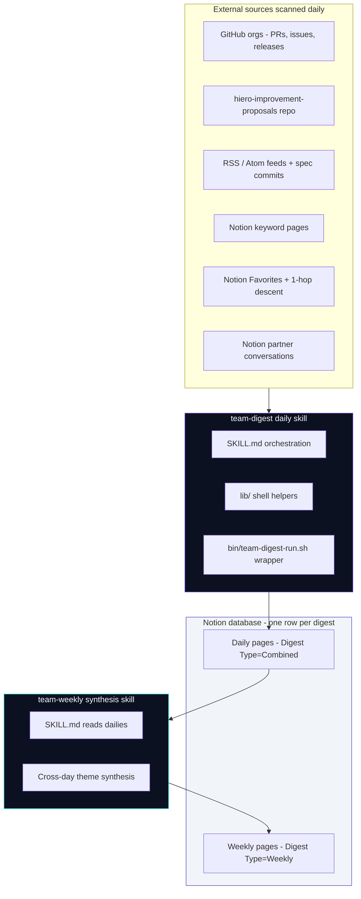
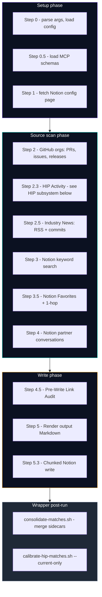
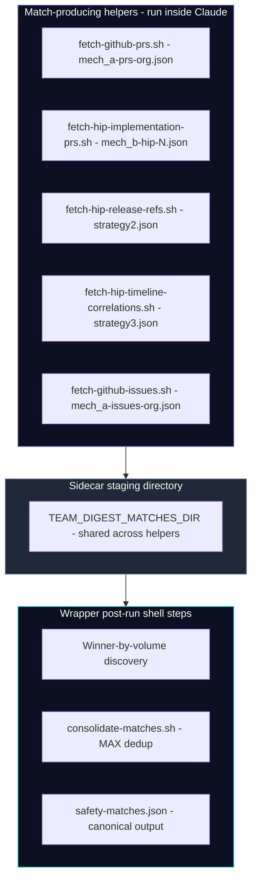
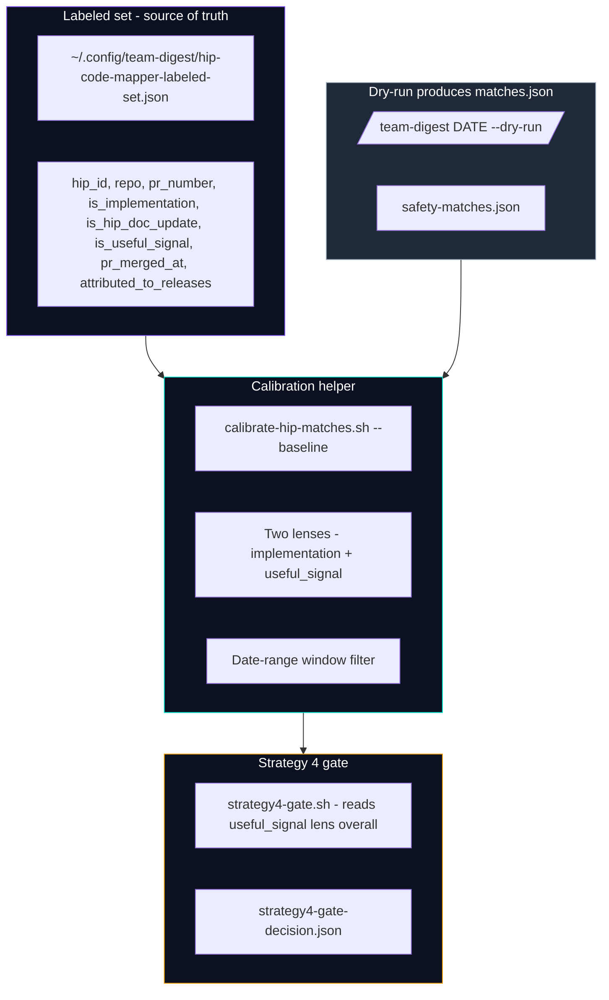
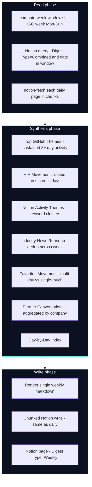
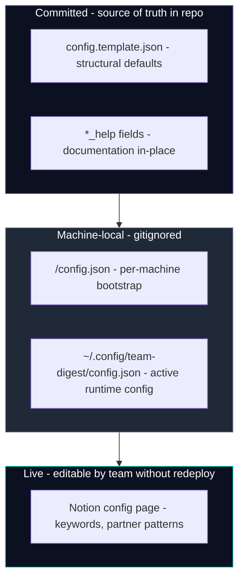
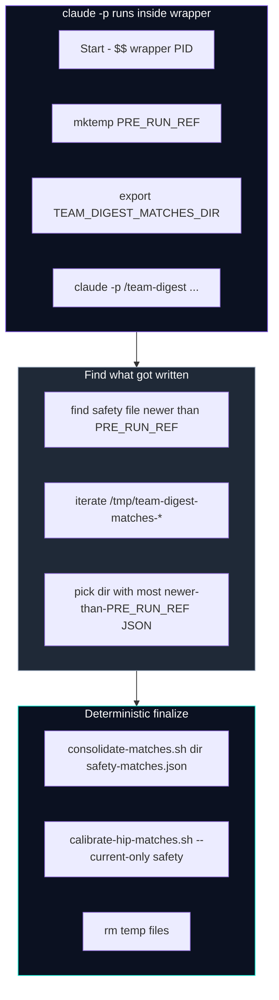

# team-digest Architecture

This doc explains how `team-digest` works end-to-end: the two skills, the daily pipeline, the HIP matching subsystem, the calibration loop, the weekly synthesis layer, and the wrapper plumbing that holds it together. Read this before working in `skills/team-digest/SKILL.md` or adding a new source.

For configuration knobs see [`docs/configuration.md`](configuration.md). For operational troubleshooting see [`docs/troubleshooting.md`](troubleshooting.md). For HIP-specific behavior see [`docs/hip-tracking.md`](hip-tracking.md).

## Table of Contents

1. [System Overview](#system-overview)
2. [Daily Pipeline (`/team-digest`)](#daily-pipeline-team-digest)
3. [HIP Matching Subsystem](#hip-matching-subsystem)
4. [Calibration Loop](#calibration-loop)
5. [Weekly Synthesis (`/team-weekly`)](#weekly-synthesis-team-weekly)
6. [Config and Wrapper Architecture](#config-and-wrapper-architecture)
7. [Extension Points](#extension-points)

---

## System Overview

`team-digest` ships two skills with an asymmetric relationship: `/team-digest` is the daily producer that scans external sources and writes one Notion page per day; `/team-weekly` is the weekly consumer that reads those daily pages back and synthesizes cross-day themes into a separate Notion page.



**Key asymmetry:** `/team-weekly` does NOT re-scan external sources. It reads daily pages from Notion (filtered by `Digest Type = Combined` and date in the target week) and synthesizes themes from what the dailies already captured. This keeps token cost bounded and avoids drift between what each cadence "saw."

**File layout** mirrors the asymmetry. `skills/team-digest/` contains the full pipeline (16 lib helpers, the SKILL.md orchestration, the TEMPLATE.md output schema). `skills/team-weekly/` contains only what synthesis needs (2 lib helpers: `compute-week-window.sh` and `README.md`; the SKILL.md; and TEMPLATE.md).

```
skills/team-digest/
├── SKILL.md          # Orchestration: which helpers to call when, MCP rules, output rendering
├── TEMPLATE.md       # Output schema (Notion-flavored markdown sections + entry shapes)
└── lib/              # 16 shell helpers - data layer, no MCP calls
    ├── compute-window.sh
    ├── load-config.sh
    ├── fetch-github-{prs,issues,releases}.sh
    ├── fetch-rss.sh
    ├── fetch-gh-commits.sh
    ├── fetch-hip-updates.sh                  # HIP detection
    ├── fetch-hip-implementation-prs.sh       # Mechanism B
    ├── fetch-hip-release-refs.sh             # Strategy 2
    ├── fetch-hip-timeline-correlations.sh    # Strategy 3
    ├── extract-hip-refs.sh
    ├── refresh-hip-index.sh
    ├── consolidate-matches.sh                # Post-run sidecar merge
    ├── calibrate-hip-matches.sh              # Precision/recall/F1 measurement
    ├── strategy4-gate.sh                     # Strategy 4 ship/defer decision
    └── README.md

skills/team-weekly/
├── SKILL.md
├── TEMPLATE.md
└── lib/
    ├── compute-week-window.sh
    └── README.md
```

The `bin/team-digest-run.sh` and `bin/team-weekly-run.sh` wrappers are the headless entry points - they invoke `claude -p "/team-digest …"` or `claude -p "/team-weekly …"` with the necessary MCP tools allow-listed, plus post-run shell steps that handle the sidecar consolidation pipeline (described below).

---

## Daily Pipeline (`/team-digest`)

The skill body in `skills/team-digest/SKILL.md` orchestrates eight numbered steps. Steps 0 through 5 run sequentially within Claude; the wrapper handles a post-Claude consolidation step.



**Source independence.** Each scan step in the SCAN phase is independent. If one source fails (rate limit, MCP outage, network error), the rest still produce output and the digest is rendered with a failure indicator in the affected section. The skill never aborts on a single-source error.

**Parallelism within steps.** Where multiple GitHub orgs are configured, Step 2 dispatches `fetch-github-prs.sh` / `fetch-github-issues.sh` / `fetch-github-releases.sh` in parallel via batched Bash tool calls. The HIP per-HIP implementation search in Step 2.3 also dispatches in parallel (one call per HIP).

**Window contract.** `compute-window.sh` resolves the date argument (or yesterday-UTC default) into `DATE_LABEL`, `START`, `END`, plus optional `LOOKBACK_START` + `LOOKBACK_DAYS` when the `github.pr_lookback_days` config knob is non-zero. Downstream callers pass `$LOOKBACK_START $END` to PR/issue helpers (wider window for lookback) but `$START $END` to releases (narrow - a wider window would re-surface old releases). The skill body emits a `[Notice]` line in the digest header when `LOOKBACK_DAYS > 0` so readers know the scan window is broader than a typical daily.

**Output rendering.** Step 5 assembles a single Notion-flavored markdown document with section headers, callouts, tables, and chunked-write sentinels. Step 5.3 splits the document on `## ` H2 boundaries into ~4KB chunks and writes them via the chunked Notion procedure (create page with placeholder, then update with each chunk) - this avoids the stream-timeout failure mode that hit single-call `notion-create-pages` writes when the body grew large.

**Recovery path.** The `--from-file <path>` subcommand skips Steps 1-4 and jumps directly to the Notion write, useful when the data-gather pipeline succeeded but the Notion write failed mid-chunk. The skill detects the `DIGEST-SECTION-BREAK` sentinel left by an interrupted write and routes back to a clean restart from that point.

---

## HIP Matching Subsystem

Step 2.3 is the most complex part of the daily pipeline because it has to answer two questions for every HIP touched on the digest day: (a) what's the HIP's current state, and (b) which PRs across the implementation orgs are working on it. Four matching strategies run in parallel, each emitting MatchRecord entries into a unified schema. A post-run consolidation step merges them deterministically.

### The MatchRecord schema

Every match-producing helper emits records with this shape:

```json
{
  "hip_id": "HIP-1137",
  "repo": "hiero-ledger/hiero-consensus-node",
  "pr_number": 18234,
  "confidence": "high",
  "sources": ["mech_a"],
  "per_source": {
    "mech_a": {"confidence": "high", "reason": "regex_annotation"}
  },
  "pr_title": "...",
  "pr_state": "MERGED",
  "pr_author": "...",
  "pr_url": "..."
}
```

The dedup key is `(hip_id, repo, pr_number)`. When two records share the dedup key, the consolidator MAX'es their confidence (`high > medium > low`) and unions their `sources[]` and `per_source` maps. A PR matched by both Mechanism A (regex) and Strategy 2 (release notes) ends up with `sources: ["mech_a", "s2"]` and `per_source` containing both strategies' reasoning.

### The five strategies

| Strategy | Helper | Trigger | Emitted confidence |
|---|---|---|---|
| Mechanism A | inline in `fetch-github-{prs,issues}.sh` | Regex finds `HIP-N` in PR/issue title or body, filtered through known-HIPs index | `high` |
| Mechanism B | `fetch-hip-implementation-prs.sh` | `gh search` against implementation_orgs using HIP-N as query | `high` |
| Strategy 2 | `fetch-hip-release-refs.sh` | Release notes from implementation_orgs mention HIP-N in tag or body, PRs attributed via `gh api compare/<prev>...<this>` | `high` (in tag) or `medium` (in body only) |
| Strategy 3 | `fetch-hip-timeline-correlations.sh` | Batched per-org `gh search prs` for PR titles/labels sharing keywords with status-changed HIPs | `medium` (3+ token overlap) or `low` (1-2 + category tiebreak) |
| Strategy 4 | gated, not yet shipped | LLM identifier-generation + gitGrep, fires only on calibration TRIGGER | `medium` |

Mechanism A is essentially free - it piggybacks on the GitHub scan that already runs for Step 2. The other strategies run sequentially within Step 2.3 in the order shown above. Each has a per-call budget and a non-fatal contract: a single-strategy failure (rate limit, network) logs inline and continues; the digest never aborts on a per-strategy error.

### Sidecar consolidation pipeline

Every match-producing helper writes structured JSON sidecars to `$TEAM_DIGEST_MATCHES_DIR` directly during the run. The wrapper merges them after Claude exits:



**Why the merge moved out of Claude's context.** An earlier design held the merged MatchRecord list in Claude's in-context state across many steps of the SKILL.md body. Under high PR volume, the list became lossy - the dry-run digest would show 9 HIPs with implementation activity in the rendered output, but only 4 in the captured matches.json. Moving the merge into a deterministic shell helper (`consolidate-matches.sh`) eliminated the data-loss path. Claude is now responsible for orchestration and judgment; the canonical output is built by shell.

**Winner-by-volume discovery.** Env-var propagation across `claude -p` subprocesses is unreliable in practice - some harness versions strip env. The wrapper's `discover_matches_dir()` function handles this by iterating ALL candidate directories matching `/tmp/team-digest-matches-*` and picking whichever has the most JSON sidecars newer than a pre-run reference file. If the SKILL.md body had to re-export `TEAM_DIGEST_MATCHES_DIR` mid-run (after a Write-tool error recovery, for example), the wrapper still finds the right directory by volume, not by name.

**BSD/GNU find portability.** The pre-run reference file replaces `find -newermt @<epoch>` (which only works on GNU find). Creating a temp file at run start and passing it to `find -newer "$REF"` works identically on BSD find (macOS) and GNU find (Linux).

### Strategy 3 category tiebreaker

Strategy 3 is the noisiest strategy because keyword overlap between HIP titles and PR titles can produce false positives. Two-tier scoring keeps the noise bounded:

| Keyword overlap | Confidence | Category map used? |
|---|---|---|
| 3+ tokens | `medium` | No - matches any repo |
| 1-2 tokens | `low` (if repo in category list) or dropped | Yes - base-rate noise filter |
| 0 tokens | dropped | n/a |

`strategy3.category_to_repos` maps HIP categories (HTS, HSS, HCS, Mirror Node, Block Node, Relay, SDK) to the repos where that category's HIPs typically land. For weak overlap (1-2 tokens), the match is kept as `low` confidence ONLY IF the PR's repo is in the category's expected-repo set. Otherwise dropped.

A HIP could legitimately touch any repo, so this is a base-rate prior, not a hard constraint. Strong matches (3+ token overlap) bypass the tiebreaker entirely. In practice Strategy 3 fires rarely - the last calibration recorded 0 records - so the tiebreaker is mostly defensive coverage for the edge case it does fire.

Category detection is best-effort: HIP frontmatter `category:` is checked first, with title-token heuristics as a fallback. Heuristic order matters - infrastructure-specific terms (`block node`, `block stream`, `json-rpc`, `relay`) route to `Block Node` or `Relay` before broader service terms (`token service`, `consensus service`, `smart contract`) catch them.

---

## Calibration Loop

The labeled set at `~/.config/team-digest/hip-code-mapper-labeled-set.json` is the source of truth for measuring matching quality. It is **strategy-independent**: built from HIP `Reference Implementation:` fields, maintainer manual recall, and external HIP-index cross-checks. Existing digest dry-run output is explicitly excluded as a seed to avoid circularity.



### Two lenses

The same labeled set is measured under two definitions of "positive":

| Lens | Positive | Negative |
|---|---|---|
| `implementation` | PR is a code change in a production codebase (narrow) | PR is a HIP doc update OR test fixture |
| `useful_signal` | PR is worth surfacing in the digest (HIP doc updates + implementations) | PR is a test fixture or template placeholder |

The Strategy 4 gate uses the `useful_signal` lens because that's closer to the digest's purpose - every match should be useful signal regardless of whether it's strictly production code.

### Date-range window

`--window-start YYYY-MM-DD --window-end YYYY-MM-DD` filters the labeled set to entries whose `pr_merged_at` OR any `attributed_to_releases` date falls in the window. Without this, a single-day dry-run is measured against a labeled set spanning multiple years - recall comes out artificially low because old positives can't be in scope of today's scan.

The `attributed_to_releases` field captures Strategy 2's semantic: a PR may have merged before the window but be attributed to a release published in the window. Without crediting this case, S2's true positives are systematically under-counted.

### Strategy 4 gate

`strategy4-gate.sh` reads the calibration baseline and applies an OR rule on the `useful_signal` lens overall metrics:

| State | Condition | Result |
|---|---|---|
| `DEFERRED_AWAITING_BASELINE` | No baseline file exists yet | Strategy 4 stays parked; run baseline first |
| `DEFER` | `recall >= 0.7 AND missed <= 5` | Strategy 4 stays parked with evidence |
| `TRIGGER` | `recall < 0.7 OR missed >= 5` | Strategy 4 is unlocked |

The decision lives at `~/.config/team-digest/strategy4-gate-decision.json` with timestamp, the metrics used, the labeled-set SHA, and the rule that fired. Re-run the gate after any baseline refresh.

### Per-run drift snapshot

Every digest run (not just dry-runs) invokes `calibrate-hip-matches.sh --current-only` at finalize. This emits the run's per-strategy match-count distribution to `~/.config/team-digest/hip-calibration-current.json` and warns on stderr if the baseline is more than 180 days old. The current snapshot doesn't measure precision/recall (it doesn't have ground truth for arbitrary digest dates) - it just tracks whether the distribution of matches has shifted relative to the baseline.

### Recalibration triggers

Re-run `calibrate-hip-matches.sh --baseline <dry-run>` when any of:

1. Labeled set is more than 6 months old.
2. A new HIP-N has been published where N exceeds the labeled-set max by 100+.
3. Strategy 4 has been triggered by the gate.
4. The per-run drift warning fires 3+ times in a 30-day window.

---

## Weekly Synthesis (`/team-weekly`)

`/team-weekly` is architecturally simple compared to the daily: no external scans, no matching strategies, no calibration. It reads the past week's daily pages from Notion and synthesizes cross-day themes into a single weekly page.



**Why a consumer, not a parallel scanner.** Re-running the matching pipeline weekly would double-count work (same GitHub PRs would be fetched 5-7 times across a week, same Notion pages searched, same HIP repo scanned). The weekly's value is *synthesis* - finding patterns across 5-7 days that no single daily can surface. A HIP that moved Draft → Last Call → Accepted across a week tells a different story than any one daily's snapshot. Repos with sustained 3+ day activity reveal trajectories that single-day rows hide.

**Asymmetry implication.** When making changes to `skills/team-digest/`, ask whether `skills/team-weekly/` needs a parallel update:

| Change touches… | team-digest | team-weekly |
|---|---|---|
| Data sources (GitHub scan, HIP scan, RSS) | Yes | No |
| Matching strategies (Mech A/B, S2, S3, S4) | Yes | No |
| `category_to_repos` and HIP tiebreaker logic | Yes | No |
| `lib/fetch-*.sh` helpers | Yes | No |
| `lib/calibrate-hip-matches.sh`, `strategy4-gate.sh`, `consolidate-matches.sh` | Yes | No |
| Chunked Notion write + page-creation flow | Yes | Yes |
| `load-config.sh` reads, profile loading | Yes | Yes |
| Output rendering rules, Mermaid, voice/tone | Yes | Yes |
| `.local.json` config plumbing, PII discipline | Both |
| `bin/<x>-run.sh` wrapper changes | Both have own wrapper - check both |

**Week-window calculation.** `compute-week-window.sh` defaults to the most recently completed ISO week (Monday through Sunday). Override with a specific `YYYY-MM-DD` (treated as a Sunday end-date) or `--from YYYY-MM-DD --to YYYY-MM-DD` for arbitrary ranges. The same chunked-write logic from the daily applies to the weekly's output, including the `DIGEST-SECTION-BREAK` sentinel for `--from-file` recovery.

**Empty-week behavior.** If no daily pages exist for the target week (or only 1-2 do), the weekly renders a minimal page noting the gap rather than fabricating themes from sparse data. The synthesis logic explicitly requires 3+ days of activity for the "sustained activity" themes; below that threshold, fall back to a simpler day-by-day index.

---

## Config and Wrapper Architecture

### Two-layer config



**Three places config lives:**

1. **`config.template.json`** (committed) - structural defaults. Every field has a sibling `<field>_help` describing what it controls. Forkers see this first.
2. **`<repo>/config.json` + `~/.config/team-digest/config.json`** (gitignored, machine-local) - active runtime config with Notion IDs, GitHub orgs, priority repos. `update.sh` deep-merges the repo's `config.json` into the global one on every run.
3. **Notion config page** (live, team-editable) - keywords, partner patterns, sometimes a Favorites list. Anyone on the team can edit without touching files. Falls back to `config.json` defaults if unreachable.

**The merge contract.** `update.sh` runs `deep_merge(repo_config, existing_global_config)`. For dicts: recurse. For non-empty leaf values: repo wins. For empty values: existing wins. For arrays: repo wins (overwrites entirely). This means template additions to arrays (like adding a new entry to `strategy3.category_to_repos.HSS`) do NOT auto-propagate to existing machines - the user gets a `[NEW]` warning listing new template paths and must manually copy the relevant block. This is intentional: auto-merging arrays would risk trampling user-specific overrides.

### Wrapper responsibilities

`bin/team-digest-run.sh` and `bin/team-weekly-run.sh` are not just `claude -p` invocations. Each wrapper:

1. **Sources environment files** - `~/.config/team-digest/env` for persistent settings like `TEAM_DIGEST_HIP_VERBOSE=1`, plus any user-provided shell exports for `GH_TOKEN`.
2. **Sets up the matches sidecar dir** (daily only) - `TEAM_DIGEST_MATCHES_DIR=/tmp/team-digest-matches-$$` before invoking Claude, so helpers have a destination.
3. **Captures a pre-run reference file** - `mktemp` creates a timestamp anchor for `find -newer "$REF"` to identify files written by THIS run vs. left over from prior runs.
4. **Invokes Claude with MCP allow-listing** - `claude -p "/team-digest …" --allowed-tools "mcp__notion__notion-search,mcp__notion__notion-fetch,…"` - the explicit allow-list prevents accidental MCP usage outside the documented set.
5. **Logs to a per-run file** - `/tmp/team-digest-runs/team-digest-<DATE_LABEL>-<ISO>.log` for post-hoc inspection of what each run did.
6. **Runs post-Claude shell steps** (daily only) - `consolidate-matches.sh` then `calibrate-hip-matches.sh --current-only`. These run AFTER Claude exits because they're deterministic shell that doesn't need Claude's judgment.
7. **Exits with Claude's exit code** so cron / launchd can detect failures.

### Wrapper post-run flow



The `set +e` / `set -e` pattern around the discovery function is important - without it, an empty matches dir (zero sidecars) would short-circuit the script via `set -e` propagation through the function's `wc -l` pipeline. Empty matches dir is a legitimate case (Claude produced no HIP matches that day) and must not crash the post-run.

---

## Extension Points

### Adding a new source

A "source" is a step in the SCAN phase of the daily pipeline. To add one (e.g., `Slack channel messages`):

1. **Write `lib/fetch-<source>.sh`** in `skills/team-digest/lib/`. Inputs as positional args (`<owner> <date>`), output as plain-text summary on stdout or JSON if structured. Set `set -euo pipefail`. Don't call MCP tools (those only work inside Claude); use `gh`, `curl`, `python3` stdlib only.
2. **Add a new step in SKILL.md** between existing scan steps. Document the section header, the empty-state behavior, and any cross-section dedup rules (e.g., if a Slack message links to a Notion page already covered by another section, decide which section wins).
3. **Add a new section to TEMPLATE.md** with the entry shape (callout style, table columns, prose format).
4. **Add config under `<digest-name>.<source>` in `config.template.json`** with sibling `*_help` fields explaining each knob. Update the deep-merge expectation for arrays.
5. **Add a row to `lib/README.md`** documenting the helper.
6. **Verify the wrapper** doesn't need new env vars or allow-list entries.

The source-independence contract still applies: a Slack scan failure must not abort other sections; the digest is produced with a failure indicator in the affected section.

### Adding a new HIP matching strategy

If a new strategy ("Strategy 5") becomes worth pursuing after the calibration loop, the pattern from S2/S3 applies:

1. **Write `lib/fetch-hip-<strategy-name>.sh`** that emits MatchRecord JSON to stdout AND a sidecar to `$TEAM_DIGEST_MATCHES_DIR/<strategy>.json`. The unified MatchRecord schema (`hip_id, repo, pr_number, confidence, sources, per_source, ...`) is non-negotiable - the consolidator deduplicates on `(hip_id, repo, pr_number)` and MAX-confidence-merges across strategies.
2. **Decide the confidence emission policy** - what justifies `high` vs `medium` vs `low` for this strategy? Document it inline in the helper header.
3. **Add the call site in SKILL.md** Step 2.3 between existing strategies.
4. **Add config under `hip_tracking.strategy<N>.*` in `config.template.json`** for any per-strategy budget/threshold knobs.
5. **Update `consolidate-matches.sh`** if the new strategy emits a different JSON shape than the existing helpers (Mech A's flat-array vs Mech B's `{hip, prs, commits}` shape). Add a parser branch if needed.
6. **Extend the labeled set's `attributed_to_releases` field** or add an analogous field if the new strategy attributes positives in a way the existing two date fields don't capture.
7. **Re-run the baseline calibration** to measure the new strategy's precision/recall against the labeled set. Watch the per-strategy table in the baseline output.

The cost-gate pattern (Strategy 4's `cost_cap_usd`) is the template for any strategy with per-run cost - emit cumulative spend on stderr, circuit-break at 100%, render a footnote in the HIP Activity section noting the partial run.

### Adding a new team-digest skill (local-only path)

The repo ships only the generic `team-digest` skill in committed form. Any additional team-specific digest stays in the local checkout - DO NOT commit to the public repo. The `.gitignore` already covers `profiles/*.md` and `config.json`; add `skills/<my-team>-digest/` to `.git/info/exclude` for defense-in-depth.

1. **Add a new top-level key to local `config.json`** (not `config.template.json`).
2. **Copy `skills/team-digest/` to `skills/<my-team>-digest/`** including the full `lib/` subdir. Change all `team-digest` references in SKILL.md to `<my-team>-digest`. Most helpers are reusable as-is; `load-config.sh` takes the digest-name as its first arg, so just call it with the new name.
3. **Create `profiles/<my-team>-digest.md`** (no `.template.md` needed - go straight to the personalized copy) with the team's role, relevance criteria, and a Project Glossary section.
4. **Copy `bin/team-digest-run.sh` to `bin/<my-team>-digest-run.sh`**; change every `team-digest` reference (the prompt, log paths, allow-listed MCPs if different).
5. **Run `./update.sh`** to install. Verify with `<my-team>-digest --dry-run`.

### Adding a new cadence

A "cadence" is a synthesis layer above the daily (weekly today, potentially monthly / quarterly / yearly). The pattern is consumer-not-scanner: read existing pages from Notion, synthesize across the longer window, write a new page back. See the team-weekly section for the template.

The trade-off worth thinking about explicitly: synthesizing from synthesis loses signal at each layer. A monthly reads weeklies; each weekly is already a compression of dailies. If a monthly theme needs a fact that wasn't preserved in weeklies, the daily layer has to surface it. Decide what monthly themes ask of the source data before adding the cadence.

---

## See also

- [`docs/configuration.md`](configuration.md) - configuration knobs, GitHub authentication, `pr_lookback_days` semantics
- [`docs/hip-tracking.md`](hip-tracking.md) - HIP Activity behavior, confidence model, verbose mode, opting out
- [`docs/scheduling.md`](scheduling.md) - cron and launchd setup for production scheduling
- [`docs/troubleshooting.md`](troubleshooting.md) - empty section recovery, rate limits, Strategy 4 budget exhaustion, `--from-file` recovery
- [`docs/roadmap.md`](roadmap.md) - shipped capabilities and parked items
- [`docs/team-digest-quickstart.md`](team-digest-quickstart.md) - 10-minute first-run walkthrough
- [`docs/team-weekly-quickstart.md`](team-weekly-quickstart.md) - first weekly synthesis walkthrough
